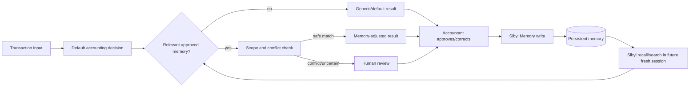

# Architecture

## Goal

Cherry Memory Ledger should make a later accounting decision depend on an accountant-approved decision from an earlier, fully terminated session. Sibyl Memory is therefore a required dependency of the learned-decision path rather than a convenience cache.

## Proposed flow



The boxes labelled **Sibyl Memory write** and **Sibyl recall/search** are not implemented in the foundation scaffold. Their code boundary is `src/cherry_memory_ledger/memory_gateway.py`.

## Components

### 1. Transaction input

For the hackathon demo, use synthetic/anonymised transactions. The first scenario should be intentionally small enough that a judge can understand the before/after decision in seconds.

### 2. Decision layer

A deterministic baseline should exist so the memory counterfactual is testable. The important comparison is:

- **without recalled memory:** generic/default outcome
- **with recalled approved memory:** changed categorisation, VAT treatment, reconciliation action, or review status

The foundation does not implement this layer yet.

### 3. Memory gateway

`MemoryGateway` is the application port. `SibylMemoryGateway` will become the concrete adapter once the supported Sibyl client/API is validated.

Planned write boundary:

```text
SibylMemoryGateway.persist_accounting_decision(...)
```

Planned read boundary:

```text
SibylMemoryGateway.recall_relevant_decisions(...)
```

This separation allows the acceptance test to prove that a **new process/client** can recall persisted knowledge instead of accidentally sharing in-memory Python state.

## Decision-memory lifecycle

1. Agent proposes a treatment.
2. Accountant corrects or approves it.
3. Application creates a structured `AccountingDecisionMemory` record.
4. Record is persisted to Sibyl.
5. Later fresh session searches/recalls candidate memories.
6. Candidate memories are filtered by business, entity, semantic similarity, status, time, and reuse scope as supported by the final implementation.
7. Active matching memory changes the decision.
8. Conflicting/insufficient memory routes to review.
9. A new approval may supersede an older memory rather than silently overwriting history.

## Temporal rule evolution

Accounting memory must not become an eternal truth. The domain model therefore includes `status` and `supersedes_memory_id`. A later implementation can demonstrate that an older rule is retained for audit/history while a newer approved rule becomes the active treatment.

This is the intended use case for Sibyl temporal/time-travel primitives if those primitives are implemented and verified during the hackathon.

## Safety and data boundaries

- Demo with synthetic or de-identified accounting data.
- Do not persist bank credentials, API secrets, personal data, or raw authentication tokens.
- Treat remembered rules as scoped decisions with provenance, not universal tax/accounting truth.
- Low-confidence or conflicting cases should route to human review.
- The prototype is not a substitute for professional accounting or tax advice.

## Partner-stack boundaries

### Base

Potential later architecture: store detailed decision context in Sibyl, then anchor only a cryptographic fingerprint/audit event on Base. No Base integration exists in the foundation commit.

### Virtuals Protocol

Potential later architecture: a bookkeeping agent raises an exception to an accounting-review agent, both using the same institutional memory. No Virtuals integration exists in the foundation commit.

## First implementation milestone

The architecture is not considered validated until the repository can demonstrate this exact sequence end to end:

```text
persist approved correction
        ↓
terminate Session A
        ↓
start genuinely fresh Session B
        ↓
recall from Sibyl
        ↓
materially change accounting decision
        ↓
show counterfactual when memory is unavailable
```
